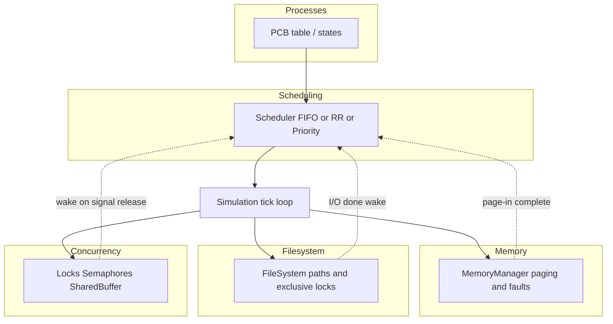
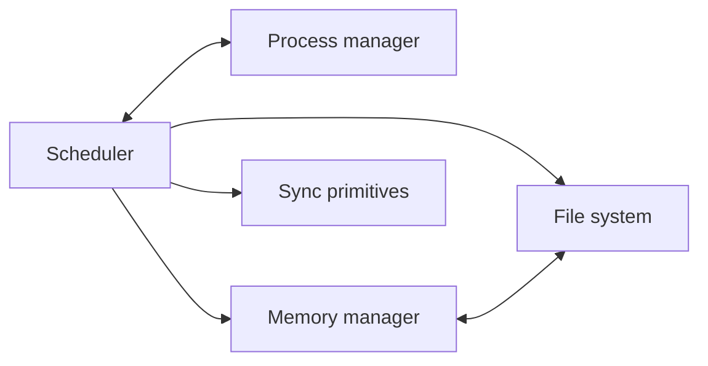

# Architecture Diagrams — Mini IoT OS Simulator

Subsystem relationships (educational / presentation). The real control flow is implemented in `os_core/simulation.py`.

## ASCII — data and control flow

```
                    +----------------+
                    |  Process table |
                    | (PCB / states) |
                    +-------+--------+
                            |
                            v
+----------------+   +-------+--------+   +------------------+
| MemoryManager  |<--|   Scheduler    |-->| FileSystem       |
| (frames,       |   | (FIFO/RR/Pri)  |   | (dirs, locks,    |
|  page faults)  |   +-------+--------+   |  I/O latency)    |
+----------------+           |          +---------+----------+
                             |                    |
                             v                    v
                    +--------+---------+  +-------+--------+
                    | SyncPorts /      |  | FileSystemPorts|
                    | Mutex, Semaphore |  | block/wake      |
                    +------------------+  +-----------------+
                             |
                             v
                    +------------------+
                    | Simulation clock |
                    | (deterministic)   |
                    +------------------+
```

## Mermaid — component interaction



## Mermaid — scheduler cross-links



The scheduler does not parse file contents or page tables directly; `Simulation._cpu_step` orchestrates: pick a runnable PCB, optionally perform a logical memory access (possibly faulting), decrement burst, and coordinate blocking for faults, file I/O, and synchronization through shared `block_process` / `wake_process` ports.
