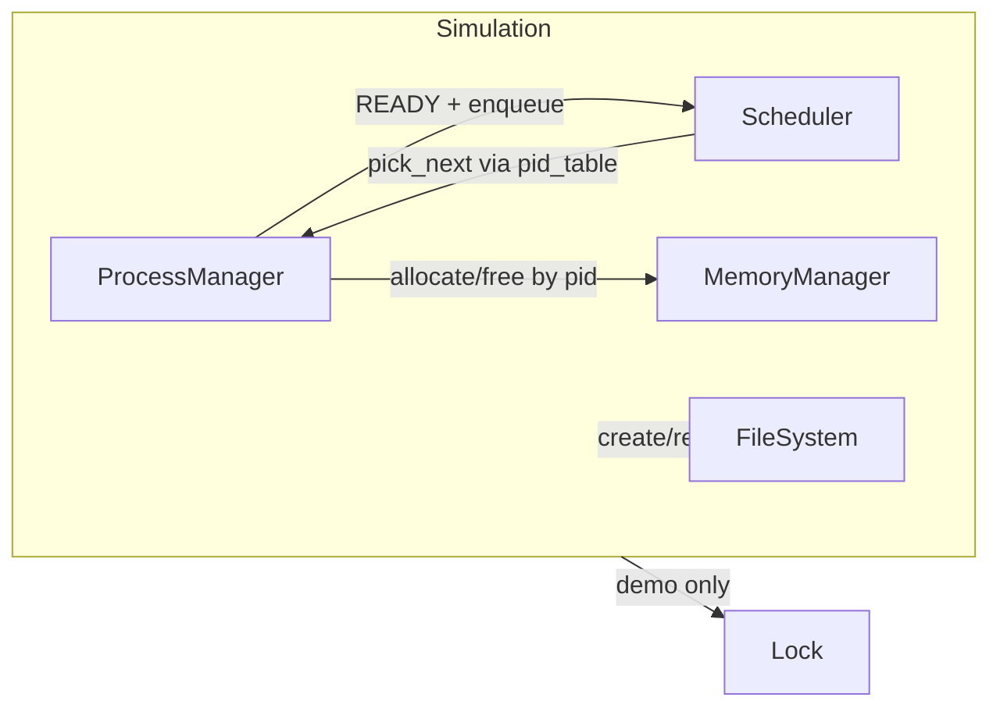

# Phase 0 Report — Mini Operating System Simulator

## 1. What was implemented in Phase 0

Phase 0 is a **Python teaching simulator** (not a real kernel). It establishes:

- A **modular package layout** (`os_core`, `process`, `memory`, `filesystem`, `concurrency`, `tests`).
- **Tagged logging** (`[Process]`, `[Scheduler]`, `[Memory]`, `[FileSystem]`, `[Concurrency]`, `[Simulation]`).
- A **PCB** model with the required fields and `ProcessState` enum.
- **ProcessManager** for create / list / state change / terminate, plus `pid_table()` for scheduler lookups.
- **FIFO Scheduler** (`deque` of PIDs, `enqueue`, `pick_next`, decision logs).
- **MemoryManager** with total size, used bytes, per-PID reservation, allocate/free, and rejection when over capacity.
- **FileSystem** backed by an in-memory `dict` (create, read, write, delete).
- **Lock** mutex skeleton (`acquire` / `release`, owner `pid`, logs).
- **Simulation** class wiring the above with **`run_phase0_demo()`**: processes → memory → READY + enqueue → lock demo → several **one-tick FIFO** dispatches → file I/O → explicit terminate + free → drain remaining ready queue.
- **`main.py`**, **`README.md`**, **`requirements.txt`**, **`pytest.ini`**, smoke **tests**, and this report.

`Simulation` is imported from **`os_core.simulation`** (not from `os_core`’s `__init__.py`) to avoid a circular import with `filesystem` → `os_core.logger` during package initialization.

---

## 2. File-by-file explanation

| File | Purpose |
|------|---------|
| `main.py` | Constructs `Simulation` and calls `run_phase0_demo()`. |
| `README.md` | How to run the demo and tests; package map; import note for `Simulation`. |
| `requirements.txt` | Declares `pytest`. |
| `pytest.ini` | `testpaths` + `pythonpath = .` for stable imports. |
| `PHASE_0_REPORT.md` | This document. |
| `os_core/__init__.py` | Re-exports **logging only** (no `Simulation` import). |
| `os_core/logger.py` | `log(component, msg)` and `get_logger(component)` with allowed component names. |
| `os_core/simulation.py` | `Simulation` and `run_phase0_demo()` narrative. |
| `process/__init__.py` | Exports PCB, manager, scheduler. |
| `process/pcb.py` | `ProcessState`, `PCB` dataclass. |
| `process/process_manager.py` | Process registry and lifecycle; `pid_table()`. |
| `process/scheduler.py` | FIFO ready queue and `pick_next`. |
| `memory/__init__.py` | Exports `MemoryManager`. |
| `memory/memory_manager.py` | Logical memory accounting. |
| `filesystem/__init__.py` | Exports `FileSystem`. |
| `filesystem/file_system.py` | Dict-backed file operations. |
| `concurrency/__init__.py` | Exports `Lock`. |
| `concurrency/locks.py` | Mutex-style lock skeleton. |
| `tests/__init__.py` | Test package marker. |
| `tests/test_basic_simulation.py` | Pytest smoke tests. |

---

## 3. Class-by-class explanation

- **`PCB`** — Holds `pid`, `name`, `state`, `priority`, `program_counter`, `memory_required`, `cpu_burst_time`, `remaining_time`, `opened_files`. If `remaining_time` is left at `0` while `cpu_burst_time > 0`, it is initialized from burst time in `__post_init__`.
- **`ProcessManager`** — Monotonic PID assignment, dict storage, `list_processes`, `change_state`, `terminate`, and `pid_table()` returning the live map used by the scheduler.
- **`Scheduler`** — FIFO queue of PIDs; `enqueue` logs invalid states and duplicates; `pick_next` pops left-to-right and skips missing or `TERMINATED` PCBs.
- **`MemoryManager`** — `allocate(pid, amount)` sets that PID’s **total reservation** (adjusting `used_memory` by delta). Rejects if usage would exceed `total_memory`. `free(pid)` releases that PID’s reservation.
- **`FileSystem`** — String keys and string contents; create/write/read/delete with existence checks and logs.
- **`Lock`** — At most one owner; failed `acquire` for another PID is logged and returns `False`; `release` validates owner.
- **`Simulation`** — Owns one instance each of manager, scheduler, memory, and FS; implements the Phase 0 demo sequence and small helpers `_dispatch_one_tick`, `_run_fifo_partial_ticks`, `_run_fifo_until_idle`.

---

## 4. How the current components interact



The scheduler stores **only PIDs**; it resolves `PCB` objects through `ProcessManager.pid_table()`. Memory is keyed by `pid` and does not read PCB internals. The file system is independent in Phase 0; later phases can record open names on `PCB.opened_files`.

---

## 5. What requirements from the teacher are partially satisfied

| Theme | Phase 0 status |
|-------|----------------|
| Process management & scheduling | PCB, manager, FIFO skeleton + tick demo |
| Memory management | Reservation accounting, reject, free |
| Concurrency & synchronization | Mutex skeleton + failed acquire in demo |
| File system | In-memory dict + CRUD |
| Cross-component interaction | `Simulation.run_phase0_demo` |
| Engineering challenge | Deferred |
| Baseline vs enhanced | FIFO documented as baseline for later policies |
| Failure scenario | Failed lock acquire; failed memory allocate path exists |
| Observability / logging | Central tagged logger |
| Report-friendly | This document + module boundaries |

---

## 6. What is NOT implemented yet

- Round Robin, priorities, aging, or preemption APIs beyond simple ticks in the demo.
- Paging, segmentation, address translation, fragmentation visualization.
- Real `BLOCKED` I/O paths (only the enum value exists).
- Persistent storage, directories, permissions, open file table on PCB.
- Blocking lock wait queues, semaphores, monitors, deadlock detection.
- Parallel hardware threads (Python runs synchronously).

---

## 7. Suggested next phase

**Phase 1 — Scheduling:** introduce a **time quantum** and Round Robin (or a policy switch FIFO ↔ RR), move “CPU step” policy into one place, record turnaround/wait metrics for a baseline vs enhanced table.

---

## 8. Known limitations

- **Terminated PCBs** remain in `ProcessManager`’s dict (easy inspection; unlike reaping in real OS).
- **Ready queue** may still list PIDs of processes later marked `TERMINATED`; `pick_next` skips them (simple cleanup trade-off).
- **Memory model** is aggregate bytes, not pages or addresses.
- **`pid_table()`** exposes the internal dict intentionally for the course demo (not a defensive copy).
- **Package name `memory`** could shadow the stdlib module name `memory` if import paths are misconfigured (acceptable for a small course repo if documented).

---

## 9. Example terminal output

Excerpt from `python main.py` (see local run for full queue snapshots):

```text
[Simulation] === Phase 0 demo: FIFO + memory + FS + lock (skeleton) ===
[Process] Created process pid=1 name='init' state=NEW
[Process] Created process pid=2 name='worker' state=NEW
[Process] Created process pid=3 name='logger' state=NEW
[Memory] allocate pid=1: set reservation to 512 (used 512/4096)
[Memory] allocate pid=2: set reservation to 1024 (used 1536/4096)
[Memory] allocate pid=3: set reservation to 256 (used 1792/4096)
[Scheduler] Enqueued pid=1 name='init'; queue=[1]
[Scheduler] Enqueued pid=2 name='worker'; queue=[1, 2]
[Scheduler] Enqueued pid=3 name='logger'; queue=[1, 2, 3]
[Concurrency] demo_resource: acquired by pid=1
[Concurrency] demo_resource: acquire failed for pid=2 (held by 1)
[Concurrency] demo_resource: released by pid=1
[Concurrency] demo_resource: acquired by pid=2
[Concurrency] demo_resource: released by pid=2
[Scheduler] Picked next pid=1 name='init'
...
[FileSystem] create 'notes.txt': ok (empty)
[FileSystem] write 'notes.txt': 34 chars
[FileSystem] read 'notes.txt': 34 chars
[Simulation] FS read-back preview: 'Phase0: modular mini-OS simulator.'
[Process] Terminated pid=3 name='logger'
[Memory] free pid=3: released 256 (used 0/4096)
[Scheduler] pick_next: skip terminated pid=3
[Simulation] === Phase 0 demo end ===
```

---

## 10. Design justification

- **Why modular architecture first** — Mirrors textbook OS decomposition (CPU scheduling, memory, FS, sync). Each folder maps to one lecture or slide deck section and keeps classes small enough to defend in a viva.
- **Why FIFO as baseline** — Deterministic, minimal code, obvious queue semantics in logs. It is intentionally weak so Phase 1+ can show improved metrics with RR or priority.
- **Why memory and file system are skeletons** — Establishes **interfaces** and **observability** (`allocate`/`free`, `read`/`write`) without locking the team into a paging design before requirements stabilize.
- **Trade-off** — Favors **clarity and extensibility** over realism: no hardware, no async timer interrupt, and the demo uses **abstract integer ticks** instead of wall-clock simulation.
